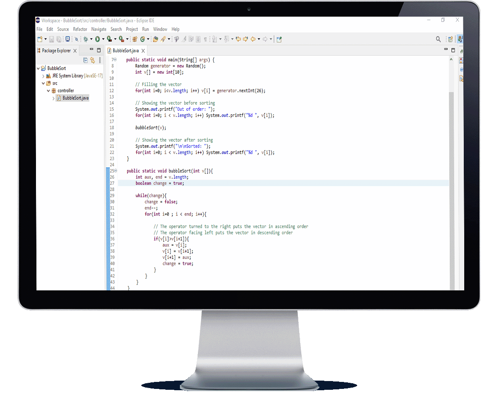

<h1 align="center"> Bubble Sort </h1>

    <a title="Sobre" href="#-sobre">Sobre</a>&nbsp;&nbsp;•&nbsp;&nbsp;
    <a title="Funcionalidades" href="#%EF%B8%8F-funcionalidades">Funcionalidades</a>&nbsp;&nbsp;•&nbsp;&nbsp;
    <a title="Tecnologias" href="#-tecnologias-utilizadas">Tecnologias</a>&nbsp;&nbsp;•&nbsp;&nbsp;
    <a title="Funcionamento" href="#-funcionamento">Funcionamento</a>&nbsp;&nbsp;•&nbsp;&nbsp;
    <a title="path" href="#-acesso-ao-projeto">path</a>&nbsp;&nbsp;•&nbsp;&nbsp;
    <a title="Autor" href="#-desenvolvedor">Autor</a>

    &nbsp;
    &nbsp;
    

 

    

### ✔️ Status: Concluído

## 🔎 Sobre

Este é um simples programa para ordenar arrays por meio do método Bubble Sort.

O Bubble sort é o algoritmo mais simples e menos eficiente em comparação com o Inserttion Sort e Selection Sort (ambos os métodos são abordados em dois repositórios no meu perfil).
Neste algoritmo, cada elemento da posição i será comparado com o seu sucessor, ou seja, um elemento da posição 2 será comparado com o elemento da posição 3. Se o elemento da posição 2 for maior do que o elemento da posição 3, eles trocam de lugar, e assim por diante. Devido a esta forma de execução, o vector terá de ser percorrido tantas vezes quantas forem necessárias, tornando o algoritmo muito repetitivo e ineficiente. E quando temos uma lista grande, o problema é ainda maior.

## ⚒️ Funcionalidades

* O programa deve ser capaz de ordenar vetores de forma crescente e decrescente.

## 🚀 Tecnologia utilizada
<table>
    <tr>
        <td>Java</td>
    </tr>
</table>

## 📷 Funcionamento

    

## 📂 Acesso ao projeto 

Acesse a pasta do projeto clicando <a href="https://github.com/mmmello/Bubble-Sort/tree/main/src">aqui</a>.

## 💻 Desenvolvedor
Matheus Mello, 2022
 
 

<i><h4 align="center">"Investir em conhecimento sempre renderá os melhores juros" 💭</h4></i>